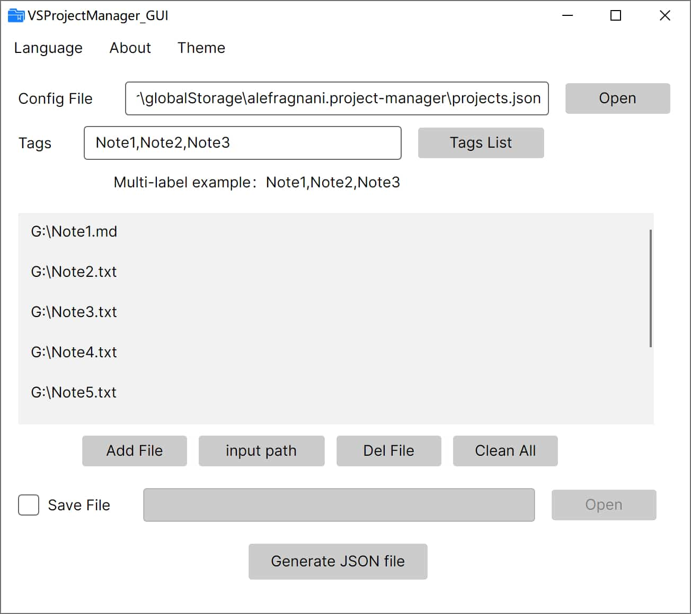

<h1 align="center">VSProjectManager_GUI</h1>

<p align="center">
  
    <br /><br />
    <a href="LICENSE"></a>
    <a href="https://github.com/SaraKale/VSProjectmanager_GUI/releases"></a>
    <a href=""></a>
    <a href=""></a>
</p>

<p align="center">
Languages: <a href="README_SC.md">简体中文</a> | <a href="README_TC.md">繁體中文</a> 
</p>

## Introduction

This is a GUI tool for batch management and generation of the `projects.json` configuration file for the VSCode extension Project Manager, enabling automatic addition of file tags and paths.  
Project Manager Extension Installation: https://marketplace.visualstudio.com/items?itemName=alefragnani.project-manager

## Key Features

- Support for dragging and dropping .json file paths for import, and support for custom JSON file export.
- Batch add input paths (multi-line text)
- Automatic deduplication
- Support for filling in tags; input `Note1, Note2, Note3` to automatically split into an array `tags`: ["Note1","Note2","Note3",].
- Day/Night theme toggling
- Multi-language support for the application (English, Simplified Chinese, Traditional Chinese)

## Download

Please select any of the nodes below to download.

|   Node    |                                 Link                                 |
| :------: | :-----------------------------------------------------------------: |
|  Github  | [releases](https://github.com/SaraKale/VSProjectmanager_GUI/releases) |
|  Gitee   | [releases](https://gitee.com/sarakale/VSProjectmanager_GUI/releases)  |
|  lanzouu   | [Download](https://wwavg.lanzouu.com/b0rayryud)   key:bskw |

Windows: [Download](https://github.com/SaraKale/VSProjectmanager_GUI/releases/download/v1.0.0/VSProjectManager_GUI_v1.0.0_win-x64.zip)  
Mac: [osx-x64](https://github.com/SaraKale/VSProjectmanager_GUI/releases/download/v1.0.0/VSProjectManager_GUI_v1.0.0_osx-x64.tar.gz) or [osx-arm64](https://github.com/SaraKale/VSProjectmanager_GUI/releases/download/v1.0.0/VSProjectManager_GUI_v1.0.0_osx-arm64.tar.gz)  
Linux: [Download](https://github.com/SaraKale/VSProjectmanager_GUI/releases/download/v1.0.0/VSProjectManager_GUI_v1.0.0_linux-arm64.tar.gz)

For Windows systems, please select `VSProjectManager_GUI_v1.0.0_win-x64.zip`.  
For macOS systems, please select `VSProjectManager_GUI_v1.0.0_osx-x64.tar.gz` or `VSProjectManager_GUI_v1.0.0_osx-arm64.tar.gz`.  
For Linux systems, please select `VSProjectManager_GUI_v1.0.0_linux-arm64.tar.gz`.

## Runtime Environment

Requires .NET 6.0 Runtime Environment to be installed. Please download it here: https://dotnet.microsoft.com/download/dotnet/6.0  
Select "Desktop Runtime" instead of "SDK" and install the version corresponding to your system.

Supported System Versions:  
Windows: Desktop requires Windows 10 1607 or later (Win7/8/8.1 are not supported); Server requires Windows Server 2016 or later.  
macOS: macOS 10.15 (Catalina) or later (10.14 and below are not supported).
Linux: LTS versions of mainstream distributions (e.g., Ubuntu 18.04 LTS, Debian 10, CentOS 7, RHEL 7, etc.).  

## Build

My Development Environment:  
System: Windows 10  
Environment: [Visual Studio 2022](https://visualstudio.microsoft.com/)  
Framework: .NET 6.0

Required Nuget Packages:
```
dotnet add package Avalonia
dotnet add package Avalonia.Desktop
dotnet add package Avalonia.Diagnostics
dotnet add package Avalonia.Fonts.Inter
dotnet add package Avalonia.Themes.Fluent
dotnet add package CommunityToolkit.Mvvm
dotnet add package Microsoft.NET.ILLink.Tasks
dotnet add package System.Text.Json
```

Then simply run `MMD MorphNote Project.sln` to compile.

Alternatively, you can compile using other methods, for example using **dotnet**:
```
dotnet publish -c Release -r win-x64
dotnet publish -c Release -r osx-x64
dotnet publish -c Release -r osx-arm64
dotnet publish -c Release -r linux-x64
```

Or simply click `BatchBuild.bat` to generate multi-platform frameworks in batch.

## Usage

1. Double-click to run the `VSProjectManager_GUI` program.
2. Select your preferred language from the menu.
3. Select and open the `projects.json` configuration file, usually located at: `C:\Users\Username\AppData\Roaming\Code\User\globalStorage\alefragnani.project-manager`
4. You can fill in a single tag or multiple tags. For multiple tags, an example is: `Note1, Note2, Note3`. Use English commas to separate them.
5. Then you can add files or manually input file paths into the list.
6. Finally, click the "Generate JSON File" button to update the JSON file content.

## License

Licensed under the [GPL-3.0 license](LICENSE)
